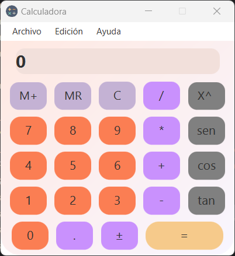
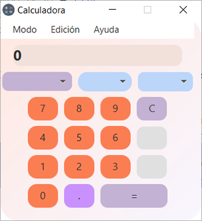
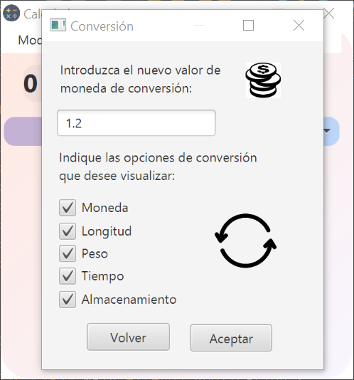

# Práctica 7.3 Calculadora científica y de conversiones

Esta práctica será evaluada para el *proyecto de final de trimestre* junto con el proyecto de la web en Bootstrap/JavaScript.

## Parte 1

Mejora la calculadora de la práctica anterior agregándole un **menú superior** que permita alternar entre la calculadora **normal** y una nueva calculadora **científica** que se cargará dentro del mismo *Stage*.

- EL menú superior mostrará una entrada llamada *modo* para alternar entre *normal* y *científica*.
- El menú superior mostrará también dos entradas de *Edición* y *Ayuda*.
- La **calculadora científica** deberá tener al menos las operaciones trigonométricas y exponenciales o porcentajes.

 

## Parte 2

Agrega otra opción al menú para tener una **calculadora de conversiones** que abra otra nueva ventana:

- El *sistema de conversiones* deberá tener un *Combobox* principal para seleccionar el método de conversión; deberá poder hacer 2-3 tipos de conversiones, incluída la monetaria (agregar otras como longitud, tiempo, etc.). 
- Se deberán agregar dos *combobox* de valor de origen y valor destino. 
- Para las conversiones monetarias se deberá fijar el *valor de conversión* desde otra **ventana modal** que se abrirá desde el menú Edición.

  

## Parte 3 (mejoras opcionales)

Realiza algunas de estas mejoras propuestas:

- Agrega un **historial** de operaciones sencillo que utilice un *listView* para almacenarlos.
- Agrega un acceso a una **API** para obtener el valor del cambio.
- Agrega **Responsividad** a la calculadora científica de forma que la ventana sea redimensionable. Si a la calculadora científica se le reduce el tamaño pasará a ser calculadora normal y si se vuelve a ampliar calculadora científica.
- Agrega una **gráfica** para representar funciones matemáticas.

| ID Caso Prueba | Descripción Caso de Prueba                         | Entrada            | Salida Esperada | Resultado |
|---------------|-------------------------------------------------|--------------------|----------------|-----------|
| CP-001       | Suma de dos números positivos                    | 5 + 3 =            | 8              |           |
| CP-002       | Suma de número positivo y negativo               | 7 + (-2) =         | 5              |           |
| CP-003       | Resta de dos números                             | 9 - 4 =            | 5              |           |
| CP-004       | Multiplicación de dos números positivos          | 6 * 3 =            | 18             |           |
| CP-005       | Multiplicación con un número negativo            | 4 * (-2) =         | -8             |           |
| CP-006       | División de dos números                          | 8 / 2 =            | 4              |           |
| CP-007       | División entre cero                              | 5 / 0 =            | Error          |           |
| CP-008       | Agregar decimal a un número                      | 3.5                | 3.5            |           |
| CP-009       | Operación con números decimales                  | 2.5 + 1.5 =        | 4.0            |           |
| CP-010       | Borrar resultados                                | 5 + 3, luego C     | Pantalla vacía |           |
| CP-011       | Uso del botón igual sin operación                | =                  | Mismo número   |           |
| CP-012       | Guardar/sumar número en memoria (M+)             | 6, M+              | Memoria = +6   |           |
| CP-013       | Borrar número en memoria (MC)                    | MC                 | Memoria = 0    |           |
| CP-014       | Recuperar número de memoria                      | MR                 | Último valor M |           |
| CP-015       | Cambio de signo positivo a negativo              | 5, +/-             | -5             |           |
| CP-016       | Cambio de signo negativo a positivo              | -7, +/-            | 7              |           |
| CP-017       | Presionar dos veces botón igual                  | = =                | mantiene valor actual |           |
| CP-018       | Presionar botón operación dos veces              | + *                | cambia + a *   |           |
| CP-019       | Los colores y tamaños de los botones cumplen criterios de usabilidad/accesibilidad    | N/D           |    |      |
| CP-020       | Seleccionar el modo en el menú                   | normal, científica, conversión       | cambiar modo   |           |
| CP-021       | Seleccionar el menú edición>borrar               |                    | borrar campos   |           |
| CP-021       | Seleccionar el menú ayuda>acerca                 |                    | mostrar ventana modal alert-info   |           |
| CP-022       | Elegir combobox de conversiones                  | Desplegar opción   | Ajuste combobox origen-destino   |           |
| CP-023       | Realizar conversiones                            | Valor conversión   | Conversión en unidades de destino   |           |
| CP-024       | Estructura del proyecto                          | N/D                | Se utiliza la división por paquetes MVC; Vista-Control-Modelo para organizar las clases. |     |
| CP-025       | Comprobación fichero `jar`                       | Proyecto compilado | Se genera y prueba el fichero `jar` empaquetado. |  |